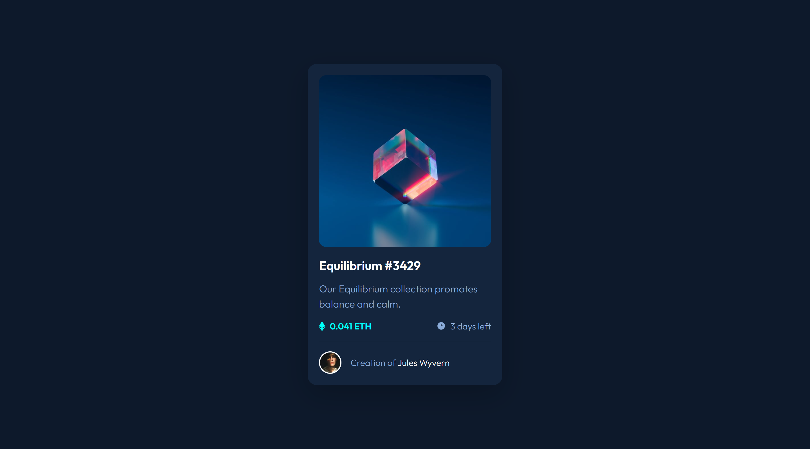
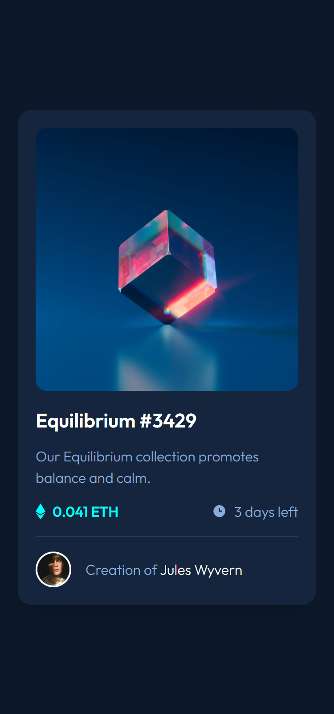

# Frontend Mentor - NFT preview card component

## Table of contents

- [Overview](#overview)
  - [The challenge](#the-challenge)
  - [Screenshots](#screenshots)
  - [Links](#links)
- [My process](#my-process)
  - [Built with](#built-with)
- [Author](#author)

## Overview

### The challenge

Users should be able to:

- View the optimal layout for the site depending on their device's screen size
- See hover states for all interactive elements on the page

### Screenshots

| Desktop View                     | Mobile View                    |
| -------------------------------- | ------------------------------ |
|  |  |

### Links

- Solution URL: [frontendmentor.io](https://your-solution-url.com)
- Live Site URL: [tobiii-mlp.vercel.app](https://tobiii-npcc.vercel.app)

## My process

### Built with

- Semantic HTML5 markup
- CSS custom properties
- CSS Grid
- Mobile-first workflow

## Author

- Website - [Emmanuel Adeyeye](https://tobiii.vercel.app)
- Frontend Mentor - [@purrrplelipton](https://www.frontendmentor.io/profile/purrrplelipton)
- Twitter - [@purrrplelipton](https://www.twitter.com/purrrplelipton)
